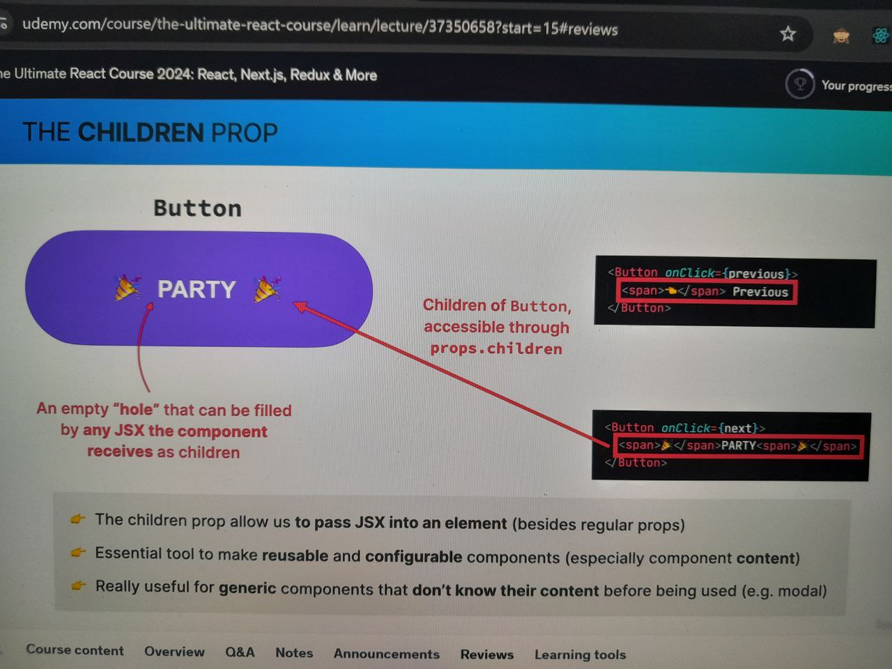

- Section 6: State, Events, and Forms: Interactive Components

- March 9, 2025

1. Section Overview
2. Build a steps components

- March 10, 2025

3. Handling Events the React Way
4. What is State in React?

- Data that a component can hold over time, necessary for info that it neeeds to remember throughout the appp's lifecycle.
- State - Components of Memory
- State - Ex. Read Notification & Messages, Input field, Tab, Content of shopping cart.

5. "State variable" / "piece of state": A single variable in a component (component state)

- Updating component state triggers React to re-render the component.
- State Allows the Devs to:

- Update the components view (by re-redndering it)
- Persist local variable renders.

- Note: State is a Tool. Mastering state will unlock the power of React Development
- Note: useState function is a hook. All start in "use" is hook.

6. Don't Set State Manually

- React is all about immutability

- March 11, 2025

7. The Mechanics of State

- It was developed by Facebook and has gained massive adoption within the web development community due to its simplicity, performance, and reusability. React follows a Declarative programming paradigm, which is a fundamental concept that makes it easier to build complex user interfaces efficiently.
- Imperative programming is a paradigm in which code explicitly describes the sequence of steps required to achieve a certain result. In the context of React, imperative programming involves manipulating the DOM (Document Object Model) directly to update the user interface.

- REACT is called "REACT" because react reacts to state changes by re-rendering the UI. DATE <-> US are Synced

8. Adding Another Piece of State
9. React Developer Tools https://react.dev/learn/react-developer-tools

- https://chromewebstore.google.com/detail/react-developer-tools/fmkadmapgofadopljbjfkapdkoienihi?hl=en&pli=1

-March 12, 2025

10. Updating State Based on Current State
11. More Thoughts About State + State Guidelines

- One component, One State - each component has & manages its own state, no matter how many times we render the same component.Each state is Isolated in one component
- UI as FXN of STATE UI = f(state), with state we view UI as a reflection of data changing over time.

8. Practical Guidelines about State

- Use state variable for any data that component should keep track of ("remember")
  over time.
- Whenever you want something in the component to be dynamic, create a piece of state related to that "thing", & update the state when the "thing" should change (aka "be dynamic")

- Example. window isOpen = True else False

- Update its state this usually happend in an event handler function.f
- Building a component, imagine its view as reflection of state changing over time.
- For data that should not trigger component re-renders, dont use state. Use regular variable instead. This is common beginner mistake.

9. A Vanilla JavaScript Implementation
10. CHALLENGE #1: Date Counter (v1)

March 26, 2025

11. The "children" Prop: Making a Reusable Button

12. More Reusability With the "children" Prop
